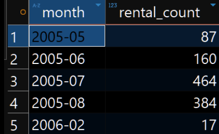
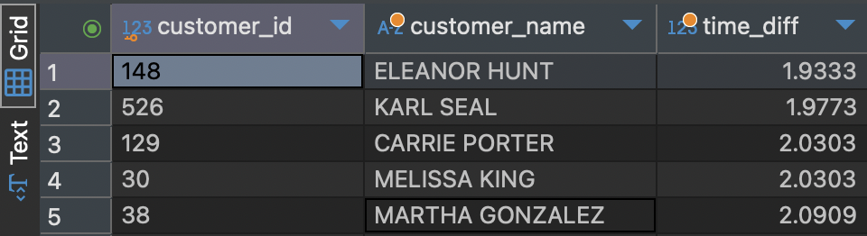

# [BigData19-MySQLProblems](https://docs.google.com/document/d/1SZTEa_kXHNqmKXE7uYUzg-ES_Vf9T-JqOeI69_fTCMc/edit?tab=t.0)
MySQL practice problems
## 문제 1: 매장별 월별 매출 분석

## 문제 2: 특정 배우가 출연한 영화의 매출 기여도 분석

## 문제 3: 가장 신속한 대여 및 반환 서비스 제공 매장 분석

## 문제 4: 대여되지 않은 영화 목록 찾기

## 문제 5: 고객의 활동성 분석

## 문제 6: 특정 카테고리의 대여 트렌드 분석

## 문제 7: 특정 기간 동안 대여된 영화 목록

## 문제 8: 고객의 평균 대여 간격 분석
